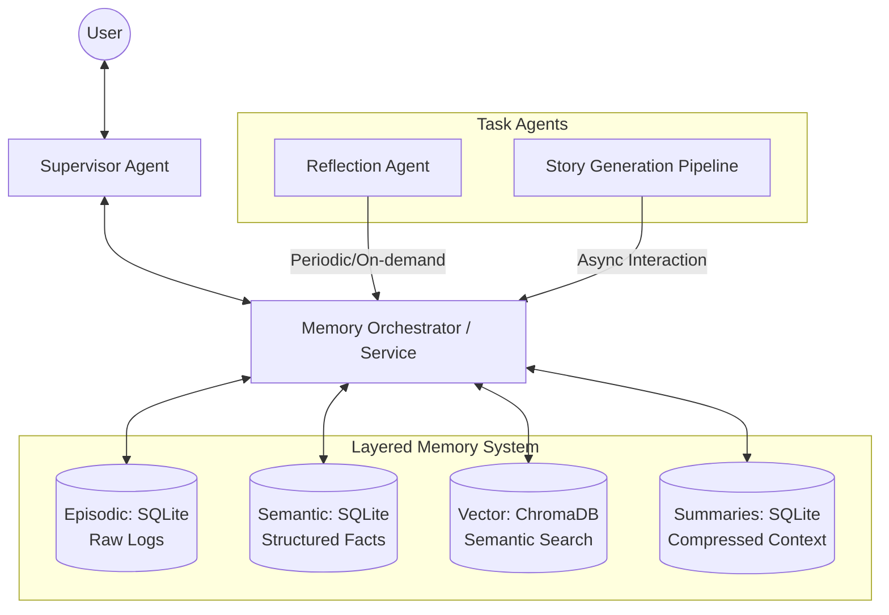

# Architecture

## Mental Model

The system follows a layered memory architecture commonly used in production AI systems:

1. **Working Memory** – short‑term context (the prompt passed to the LLM)
2. **Episodic Memory** – raw conversation history (SQLite)
3. **Semantic Memory** – structured facts about the user (SQLite with categories)
4. **Vector Memory** – embeddings for semantic search (ChromaDB)

## High‑Level Overview

## Core Components

### 1. `MemoryService` (Central Memory Manager)
- Provides a unified async API for all memory operations.
- Caches user facts and summaries to reduce DB queries.
- Manages background tasks: fact extraction, summarization, reflection.
- Coordinates concurrent writes with `asyncio.Lock`.

### 2. Agents
All agents inherit from `BaseAgent`. Key agents:
- **Supervisor** – main conversational agent; detects story requests via a special marker.
- **DraftAgent** – generates story drafts.
- **StyleCriticAgent** / **FactCriticAgent** – run concurrently to critique the draft.
- **ConsolidatorAgent** – merges feedback into a final story.
- **ReflectionAgent** – analyses all stored entries and produces high‑level insights.

### 3. Memory Layers (Low‑level Modules)
- `episodic.py` – async SQLite table for raw messages (`messages`).
- `semantic.py` – async SQLite table for key‑value entries with categories (`semantic_memory`).
- `vector_store.py` – ChromaDB wrapper using `asyncio.to_thread`.
- `summarizer.py` – async SQLite table for conversation summaries (`summaries`).

### 4. Story Pipeline (`story_pipeline.py`)
- Orchestrates the collaborative story generation:
  1. DraftAgent generates a draft (stored with category `draft`).
  2. StyleCritic and FactCritic run concurrently (store feedback with category `feedback`).
  3. Consolidator reads draft and both feedbacks, produces final story (category `final`).

### 5. Background Tasks
- **Fact extraction** – triggered after each user message; extracts key‑value facts using an LLM and stores them with category `user_fact`.
- **Summarization** – triggered when the token count of the conversation exceeds a threshold; summarises older messages and updates the summary table.
- **Reflection** – runs periodically (or on demand) to analyse all stored entries and produce insights (category `insight`).

## Data Flow (Per User Message)

1. **User input** → added to agent’s local `self.messages`.
2. `MemoryService.get_context()` returns:
   - latest summary (if any)
   - cached user facts
   - up to 3 relevant past messages (vector search on current query)
3. **Store user message** → episodic + vector + background fact extraction.
4. **Summarization check** → if token count > threshold, older messages are summarized and `self.messages` trimmed.
5. **Prompt built** = system + summary + facts + retrieved chunks + recent messages.
6. **Streaming response** from LLM (async OpenAI client).
7. **Store assistant message** → episodic + vector.
8. Background tasks continue (fact extraction, periodic reflection).

## Why Async?

- All database operations (`aiosqlite`) and network calls (embeddings, LLM) are non‑blocking.
- Multiple agents can be served concurrently without blocking the event loop.
- Background tasks (fact extraction, summarization) run without interfering with user interaction.

## Token‑Based Summarization

- Token count is computed using `litellm.token_counter`, which automatically picks the correct tokenizer for the active model.
- When total tokens exceed `SUMMARIZATION_TOKEN_THRESHOLD`, the `MemoryService` calls the summarizer.
- Summarization is synchronous (blocking) for simplicity, but can easily be moved to a background task.

## Reflection Agent Enhancements

- The reflection agent analyses **all** stored entries (user facts, drafts, feedback, final stories) to generate insights.
- Insights are stored with category `insight` and can be used for meta‑cognition or future decision‑making.
- Reflection can be triggered manually (`/reflect`) or periodically (via `asyncio.create_task`).

## Design Decisions

- **Single `MemoryService` per session** – keeps caching simple and avoids cross‑session interference.
- **Categorised semantic table** – separates user facts from drafts, feedback, and insights, preventing context pollution.
- **Streaming responses** – gives immediate feedback to the user.
- **Concurrent critics** – demonstrates true parallelism and shared memory.
- **Smart supervisor** – reduces manual work for the user; the system decides when to start the pipeline.